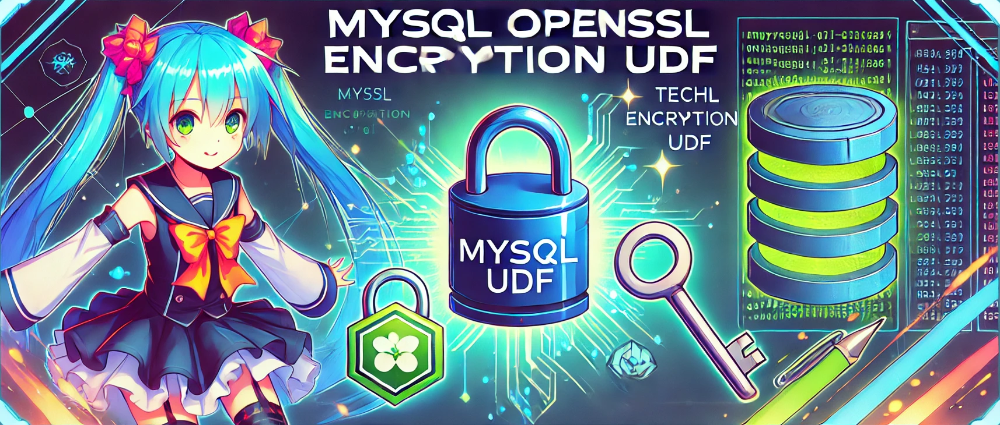

# MySQL OpenSSL UDF


[](https://codecov.io/github/white-rabbit-1-sketch/mysql-openssl)



This project provides **User-Defined Functions (UDF)** for **MySQL**, enabling **encryption** and **decryption** of data using the **OpenSSL** library. The functions support various encryption algorithms and allow the use of optional **custom IVs** (Initialization Vectors).

## Features

- **Encrypt and decrypt** data using OpenSSL.
- Support for a wide range of encryption algorithms (e.g., AES, Camellia, DES, ChaCha20, **Gost89**).
- **No Code Changes**: Applications interacting with the database **do not need any modifications**. The encryption and decryption logic are handled at the database level by using views and triggers (optional), encryption and decryption are performed **automatically** without developers or users needing to handle it directly.
- **Full Query Support**: All types of queries (e.g., `SELECT`, `LIKE`, `MATCH ... AGAINST`, `INSERT`, `UPDATE`) are fully supported when applied to decrypted columns via views.
- Optional custom IV input for advanced encryption flexibility.

## ⭐️ Star the Project

If you found this project useful, please consider giving it a star! 🌟 Your support helps improve the project and motivates us to keep adding new features and improvements. Thank you! 🙏

## Table of Contents

1. [Features](#features)
2. [Installation](#installation)
    - [1. Prerequisites](#1-prerequisites)
    - [2. Build the Library](#2-build-the-library)
    - [3. Install the UDF Library](#3-install-the-udf-library)
    - [4. Register the Functions in MySQL](#4-register-the-functions-in-mysql)
    - [5. Uninstallation](#5-uninstallation)
3. [Available Functions](#available-functions)
    - [openssl_encrypt](#openssl_encrypt)
    - [openssl_decrypt](#openssl_decrypt)
    - [openssl_get_last_error](#openssl_get_last_error)
4. [Supported Algorithms](#supported-algorithms)
    - [Tested Algorithms](#tested-algorithms)
5. [Transparent Integration of Data Encryption](#transparent-integration-of-data-encryption-optional)
    - [1. Creating Encrypted Tables](#1-creating-encrypted-tables)
    - [2. Creating a View for Transparent Encryption and Decryption](#2-creating-a-view-for-transparent-encryption-and-decryption)
    - [3. Querying Encrypted Data Transparently](#3-querying-encrypted-data-transparently)
6. [Important Considerations](#important-considerations)
7. [FAQ (Frequently Asked Questions)](#faq-frequently-asked-questions)
8. [Author and License](#author-and-license)

---

## **Installation**

Follow these steps to install and configure the `mysql-openssl` library as a MySQL User-Defined Function (UDF).

### **1. Prerequisites**

Before installation, ensure the following dependencies are met:

- **MySQL**: Version 8.0 or higher.
- **OpenSSL**: Ensure OpenSSL is installed and configured on your system.
- **Build Tools**:
  - C++17-compatible compiler (`g++` or `clang++`)
  - `make` or `cmake`
  - `libmysqlclient` and `libssl` development libraries.
  - (optional) To run the unit tests for this library, the following dependencies are required:
    - `libgtest`
    - `mysql-connector-python`
    - `pytest`
    - `lcov`

On Debian-based systems, you can install the required tools with:

```bash
sudo apt update
sudo apt install -y build-essential libmysqlclient-dev libssl-dev libgtest-dev lcov
```

### **2. Build the Library**

Clone the repository and navigate to the project directory:

```bash
git clone <repository-url>
cd mysql-openssl
make
```

The compiled shared library will be created in the `build` directory as `openssl_encryption_udf.so`.

### **3. Install the UDF Library**

```bash
make install
```

By default, running `make install` will copy the compiled library to MySQL's default plugin directory (e.g., `/usr/lib/mysql/plugin/`).
If you want to install the library to a custom location, copy the library file manually:

```bash
sudo cp build/openssl_encryption_udf.so /path/to/your/custom/plugin/directory/
```

### **4. Register the Functions in MySQL**

Connect to your MySQL server as an administrative user and register the UDF functions:

```sql
CREATE FUNCTION openssl_encrypt RETURNS STRING SONAME 'openssl_encryption_udf.so';
CREATE FUNCTION openssl_decrypt RETURNS STRING SONAME 'openssl_encryption_udf.so';
CREATE FUNCTION openssl_get_last_error RETURNS STRING SONAME 'openssl_encryption_udf.so';
```

If you installed the library to a custom location, ensure the directory is included in MySQL's `plugin_dir` configuration. You can verify the current plugin_dir value with:

```sql
SHOW VARIABLES LIKE 'plugin_dir';
```

### **5. Uninstallation**

To remove the UDF functions and the library file:

#### 5.1. Drop the UDF functions:
```sql
DROP FUNCTION IF EXISTS openssl_encrypt;
DROP FUNCTION IF EXISTS openssl_decrypt;
DROP FUNCTION IF EXISTS openssl_get_last_error;
```

#### 5.2. Remove the library file:
```sql
sudo rm /usr/lib/mysql/plugin/openssl_encryption_udf.so
```

---

## Available Functions

### `openssl_encrypt`

Encrypts the given plaintext using the specified cipher and key.

#### **Syntax**
```sql
SELECT openssl_encrypt(cipher_name, key, plaintext, [iv]);
```

#### **Parameters**

| **Parameter**  | **Type**  | **Required** | **Description**                                                                 |
|----------------|-----------|--------------|---------------------------------------------------------------------------------|
| `cipher_name`  | STRING    | Yes          | The name of the encryption algorithm. Example: `'aes-256-cbc'`, `'aes-128-gcm'`.|
| `key`          | STRING    | Yes          | The encryption key. Length must match the key length for the chosen cipher.     |
| `plaintext`    | STRING    | Yes          | The data to encrypt.                                                            |
| `iv`           | STRING    | No           | The initialization vector (IV). If not provided, a random IV is generated.      |

#### **Return Value**

The function returns a **binary string** containing the encrypted data. The IV is prepended to the encrypted data. If encryption fails, the function returns `NULL`.

#### **Examples**

##### **1. Encrypt with a random IV**

```sql
SELECT openssl_encrypt('aes-256-cbc', '12345678901234567890123456789012', 'Hello, World!');
```

##### **2. Encrypt with a custom IV**

```sql
SELECT openssl_encrypt('aes-256-cbc', '12345678901234567890123456789012', 'Hello, World!', '1234567890123456');
```

**Warning!**
If you are not familiar with cryptographic practices, it is recommended to avoid using custom IVs. By default, the library will automatically generate a secure IV for you. Using custom IVs without proper knowledge can lead to security vulnerabilities. Please proceed with caution.

### `openssl_decrypt`

Decrypts the given encrypted text using the specified cipher and key.

#### **Syntax**
```sql
SELECT openssl_decrypt(cipher_name, key, encryptedtext);
```

#### **Parameters**

| **Parameter**  | **Type**  | **Required** | **Description**                                                                  |
|----------------|-----------|--------------|----------------------------------------------------------------------------------|
| `cipher_name`  | STRING    | Yes          | The name of the encryption algorithm. Example: `'aes-256-cbc'`, `'aes-128-gcm'`. |
| `key`          | STRING    | Yes          | The decryption key. Length must match the key length for the chosen cipher.      |
| `encryptedtext`   | STRING    | Yes          | The encrypted data to decrypt. It must include the IV.                           |

#### **Return Value**

The function returns a **binary string** containing the decrypted data. If decryption fails, the function returns `NULL`.

#### **Examples**

##### **1. Decrypt with matching parameters**

```sql
SELECT openssl_decrypt(
    'aes-256-cbc', 
    '12345678901234567890123456789012', 
    openssl_encrypt(
        'aes-256-cbc', 
        '12345678901234567890123456789012', 
        'Hello, World!'
    )
);
```

---

### **openssl_get_last_error**

Returns the last error message generated by the encryption functions.

#### **Syntax**

```sql
SELECT openssl_get_last_error();
```

#### **Parameters**

This function **does not accept any parameters**.

#### **Return Value**

- If an error occurred in the previous call to the encryption functions (e.g. `openssl_encrypt` or `openssl_decrypt`), this function returns the corresponding **error message** as a **binary string**.
- If no error occurred, the function returns `NULL`.

#### **Examples**

##### **1. Successful encryption and decryption**

```sql
SELECT openssl_encrypt('aes-256-cbc', '12345678901234567890123456789012', 'Hello, World!');
-- Returns encrypted data

SELECT openssl_get_last_error();
-- Returns NULL because no error occurred
```

##### **2. Error due to invalid key length**

```sql
SELECT openssl_encrypt('aes-256-cbc', 'shortkey', 'Hello, World!');
-- Returns NULL due to invalid key length

SELECT openssl_get_last_error();
-- Returns: "Invalid key length for cipher: aes-256-cbc. Expected key length: 32, provided: 8"
```

##### **3. Error during decryption**

```sql
SELECT openssl_decrypt('aes-256-cbc', 'wrongkey1234567890123456789012', '<encrypted_data>');
-- Returns NULL due to failed decryption

SELECT openssl_get_last_error();
-- Returns: "Decryption failed: bad decrypt"
```

---

## **Supported Algorithms**

The library functions are designed to support **all symmetric encryption algorithms** available in your **OpenSSL** build. Symmetric algorithms are those where the same key is used for both encryption and decryption.

### **Tested Algorithms**

The following encryption algorithms have been **tested** for compatibility:

- **AES (Advanced Encryption Standard)**
    - `aes-128-cbc`
    - `aes-128-ecb`
    - `aes-192-cbc`
    - `aes-192-ecb`
    - `aes-256-cbc`
    - `aes-256-ecb`

- **Camellia**
    - `camellia-128-cbc`
    - `camellia-128-ecb`
    - `camellia-192-cbc`
    - `camellia-192-ecb`
    - `camellia-256-cbc`
    - `camellia-256-ecb`

- **DES (Data Encryption Standard)**
    - `des-cbc`
    - `des-ecb`
    - `des-ede-cbc`
    - `des-ede3-cbc`

- **SEED**
    - `seed-cbc`
    - `seed-ecb`

- **GOST 89**
    - The `gost89` algorithm is supported **if it is enabled and configured in your OpenSSL build**.

### **Additional Notes**

- The availability of specific algorithms depends on your OpenSSL installation and configuration.
- Ensure that the required ciphers are enabled in OpenSSL to use them with these functions.

---

## **Transparent Integration of Data Encryption (optional)**

Using this library, you can **transparently integrate encryption and decryption** into your MySQL database without modifying the application logic. This can be particularly useful for securing sensitive data, such as **personal data** (PII), payment information, or any confidential content.

By utilizing **database views** that leverage the `openssl_encrypt` and `openssl_decrypt` functions, you can ensure that data is encrypted when stored and decrypted when queried. This approach does not require changes to the application that interacts with the database.

---

### **1. Creating Encrypted Tables**

Assume you have a table `users` with columns that contain sensitive data, such as `email` and `phone`:

```sql
CREATE TABLE users (
    id INT PRIMARY KEY AUTO_INCREMENT,
    email BLOB NOT NULL,
    phone BLOB NOT NULL
);
```

Here, `BLOB` is used to store encrypted data, as encrypted content may not always be valid text.

### **2. Creating a View for Transparent Encryption and Decryption**

You can create a view to handle encryption when inserting data and decryption when querying data:

```sql
-- Replace 'your_key_here' with a secure encryption key
CREATE VIEW users_view AS
SELECT
  id,
  openssl_decrypt('aes-256-cbc', 'your_key_here', email) AS email,
  openssl_decrypt('aes-256-cbc', 'your_key_here', phone) AS phone
FROM users;
```

To ensure encryption happens automatically during INSERT or UPDATE operations, use triggers:

```sql
DELIMITER //

CREATE TRIGGER encrypt_users_before_insert
  BEFORE INSERT ON users
  FOR EACH ROW
BEGIN
  SET NEW.email = openssl_encrypt('aes-256-cbc', 'your_key_here', NEW.email);
    SET NEW.phone = openssl_encrypt('aes-256-cbc', 'your_key_here', NEW.phone);
END;
//

CREATE TRIGGER encrypt_users_before_update
  BEFORE UPDATE ON users
  FOR EACH ROW
BEGIN
  SET NEW.email = openssl_encrypt('aes-256-cbc', 'your_key_here', NEW.email);
    SET NEW.phone = openssl_encrypt('aes-256-cbc', 'your_key_here', NEW.phone);
END;
//

DELIMITER ;
```

### **3. Querying Encrypted Data Transparently**

Now, when applications query the `users_view`, the data will be automatically decrypted:

```sql
SELECT * FROM users_view;
```

When inserting or updating data, use the view instead of the base table. The triggers will handle encryption transparently:

```sql
-- Insert data (automatically encrypted)
INSERT INTO users_view (email, phone) VALUES ('user@example.com', '123-456-7890');

-- Update data (automatically encrypted)
UPDATE users_view
SET email = 'new_email@example.com'
WHERE id = 1;
```

### **4. (Optional) Installing on an Existing Database with Data**

If you are installing this library on an **existing database** that already contains data, the following additional steps are required to ensure that existing data is encrypted properly.

**Modify the Table Schema**
```sql
ALTER TABLE users MODIFY email BLOB;
ALTER TABLE users MODIFY phone BLOB;
```

**Encrypt Existing Data**

Existing data in the database will not be encrypted automatically. You need to manually update the table to apply encryption to all existing rows.

```sql
UPDATE users
SET email = openssl_encrypt('aes-256-cbc', 'your_secure_key', email),
    phone = openssl_encrypt('aes-256-cbc', 'your_secure_key', phone);
```

This query reads the plaintext data from each row and encrypts it using the specified key and algorithm.

### **5. (Optional) Storing and Passing Encryption Keys in Session**
You can securely store encryption keys in a session and pass them to the encryption and decryption functions when needed.
When encryption or decryption is needed, the key stored in the session is passed to the `openssl_encrypt` and `openssl_decrypt` functions. 
This can be done by referencing the session variable that holds the key.

```sql
SET @session_encryption_key = '<your key>';
SELECT openssl_encrypt('aes-256-cbc', @session_encryption_key, 'Hello, World!');
```

---

## **Important Considerations**

1. **Key Management**:  
   Use a secure method for storing and managing encryption keys. Keys should not be hardcoded directly in views or triggers. Consider using a key management system (KMS) or environment variables for secure key storage.

2. **Performance Impact**:  
   Encrypting and decrypting data on-the-fly can add computational overhead, especially for queries with large datasets or frequent access to encrypted columns. To optimize performance:
  - Use indexing carefully on encrypted data.
  - Decrypt data only when absolutely necessary.

3. **Storage Space**:  
   Encrypted data typically consumes more space than plaintext data due to padding or IV (Initialization Vector) storage. Ensure your table schema accounts for this.

4. **Compatibility**:  
   The library supports all symmetric encryption algorithms available in OpenSSL, including `AES`, `DES`, and `CAMELLIA`. If using algorithms like `GOST89`, ensure OpenSSL is compiled with the required support.

5. **Algorithm Selection**:  
   Choose strong and well-tested encryption algorithms such as `aes-256-cbc` for data security. Avoid outdated or weak algorithms like plain `DES`.

6. **Custom IVs**:  
   If you need control over the Initialization Vector (IV), you can pass custom IVs as arguments to the `openssl_encrypt` function. If not provided, the function generates a secure random IV automatically. Ensure the same IV is used during decryption.

---

## **FAQ (Frequently Asked Questions)**

### **1. What makes this library better than existing solutions?**

This library provides a lightweight and flexible way to integrate **OpenSSL encryption** directly into MySQL as **User-Defined Functions (UDFs)**. Key advantages include:

- **Performance**: Encryption and decryption are executed directly within MySQL without additional middleware.
- **Flexibility**: Supports all symmetric algorithms available in your OpenSSL build.
- **Transparency**: The functions work directly with SQL queries, enabling easy integration into existing applications.

Unlike other solutions that rely on external libraries or plugins, this approach keeps the encryption logic within MySQL, simplifying deployments and reducing dependencies.

### **2. Where can I use this library?**

You can use this library for **data encryption** and **decryption** in MySQL wherever sensitive data is stored or transmitted. Typical use cases include:

- **Securely storing sensitive information** such as PII, payment data, and passwords.
- **Encrypting logs or audit trails** for compliance and regulatory purposes.
- **Implementing database-level encryption** to enhance security.
- **Integrating with legacy systems** that require encryption without changing application logic.

### **3. Does this library support GOST 89 encryption?**

Yes, the **GOST 89 algorithm** is supported if it is enabled and configured in your OpenSSL installation. The availability depends on how OpenSSL was compiled on your server.

### **4. Can I add my own encryption algorithms?**

The library uses OpenSSL as its encryption backend. If you have a custom encryption algorithm implemented in OpenSSL, it can be used with this library as long as OpenSSL recognizes the cipher name. No modifications to the library code are required.

### **5. Does this library support asymmetric encryption algorithms (e.g., RSA)?**

Not yet. Currently, the library only supports **symmetric encryption algorithms**.

Support for **asymmetric encryption** (e.g., RSA, ECC) will be added in future versions to enable advanced use cases like secure key exchange and digital signatures.

### **6. What happens if I provide an incorrect encryption key or invalid parameters?**

If an error occurs, the encryption or decryption function will return `NULL`. The `openssl_get_last_error` function can be used to retrieve detailed error messages for debugging.

### **7. How do I handle padding during encryption and decryption?**

Currently, padding is handled automatically, and manual padding configuration is not supported in this version. Future releases will include fine-grained control over padding options.

### **8. What are the requirements for using this library?**

- **MySQL version**: MySQL 8.0 or higher.
- **OpenSSL**: OpenSSL must be installed and configured on your server.
- **Build Tools**: A C++17-compatible compiler, along with `make`, `cmake`, or other build systems.

### **9. Can I use this library with other MySQL plugins?**

Yes, this library works independently of other MySQL plugins. It integrates as a set of UDFs, ensuring compatibility with existing MySQL installations.

---

## Author and License

**Author**: Mikhail Chuloshnikov

**License**: MIT License

This library is released under the MIT License. See the [LICENSE](LICENSE) file for more details.
